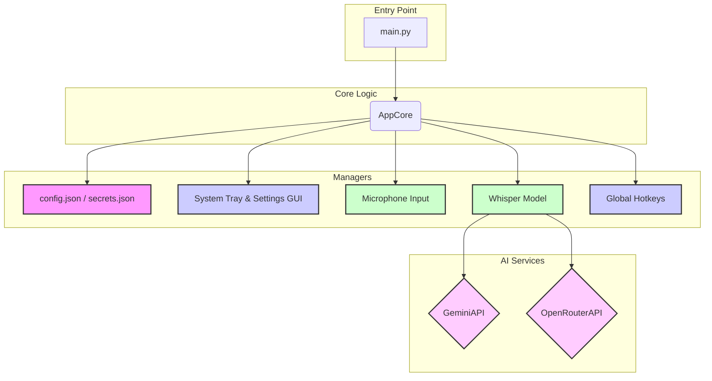

# Whisper Transcription App

A lightweight, high-performance desktop tool for Windows that turns your speech into text using OpenAI's Whisper model. It offers optional integration with Google Gemini or OpenRouter to automatically polish the output, providing superior punctuation and grammar.


## Table of Contents

1.  [Features](#features)
2.  [System Architecture](#system-architecture)
3.  [Installation](#installation)
4.  [Direct or Module Execution](#direct-or-module-execution)
5.  [Configuration](#configuration)
6.  [Usage](#how-to-use-the-app)
7.  [Troubleshooting](#troubleshooting)
8.  [Contributing](#contributing)
9.  [Running Tests](#running-tests)
10.  [License](#license)

## Features

*   **High-Quality Transcription:** Powered by the `openai/whisper-large-v3` model for state-of-the-art speech recognition.
*   **GPU Acceleration:** Automatically utilizes your NVIDIA GPU (if available) for significantly faster transcriptions, with fallback to CPU.
*   **Turbo Mode (disabled by default):** Applies Flash Attention 2 through `BetterTransformer` for faster processing when `use_turbo` is set to `true`. Requires an NVIDIA Ampere or newer GPU. `BetterTransformer` is bundled with the dependencies—no extra installation needed.
*   **Flash Attention 2:** Enabled by default. Provides optional acceleration with optimized kernels. Toggle the setting in the GUI or set `use_flash_attention_2` in `config.json`.
*   **Dynamic Performance:** Intelligently adjusts batch sizes based on available VRAM for optimal performance.
*   **Customizable Hotkeys:**
    *   Activate recording with a global hotkey that works anywhere in Windows.
    *   Supports both **Toggle Mode** (press once to start, press again to stop) and **Hold Mode** (record only while the key is held down).
    *   Dedicated "Agent Mode" hotkey for special commands.
*   **AI-Powered Text Correction (Optional):**
    *   Integrates with **Google Gemini** or **OpenRouter** to automatically correct punctuation, grammar, and remove speech disfluencies.
    *   Prompts are fully customizable through the settings GUI.
*   **Agent Mode:** Use a separate hotkey to process your speech with a different, customizable prompt (e.g., "translate this to English", "summarize this text").
*   **User-Friendly Interface:**
    *   Runs discreetly in the system tray, showing the current status via icon colors.
    *   An intuitive GUI for managing all settings without editing files.
    *   Quickly switch between Gemini models directly from the tray menu.
*   **Auditory Feedback:** Optional sound cues for starting and stopping recording.
*   **Automatically remove silent sections** using the Silero VAD. Initialization uses `onnxruntime` with automatic selection of `CUDAExecutionProvider` when available, falling back to `CPUExecutionProvider`.
*   **Robust and Stable:** Includes a background service to ensure hotkeys remain responsive, a common issue on Windows 11.
*   **Unified `TRANSCRIBING` State:** recording, Whisper processing, and optional AI correction all occur while the application remains in this state. Once the final text is ready, the state returns to `IDLE`.

## System Architecture

The application is built with a modular architecture to separate concerns, making it easier to maintain and extend.



*   **`main.py`**: The entry point that initializes and runs the application.
*   **`AppCore`**: The central brain, coordinating all other modules and managing the application's state.
*   **`ConfigManager`**: Loads and saves all user settings from `config.json` and `secrets.json`.
*   **`UIManager`**: Manages all GUI elements, including the system tray icon and the settings window.
*   **`AudioHandler`**: Manages microphone input, recording, and sound feedback.
*   **`TranscriptionHandler`**: Manages the Whisper model, runs the streaming transcription pipeline through the private method `_transcribe_audio_chunk`, and coordinates with AI correction services.
*   **`KeyboardHotkeyManager`**: Listens for and handles global hotkeys.
*   ****`GeminiAPI` / `OpenRouterAPI`**: Clients for interacting with external AI services and text correction. Both expose the method `reinitialize_client()` to reload key and model at runtime.
### Streaming Transcription Pipeline

Audio is processed in discrete chunks. `TranscriptionHandler` calls the private method `_transcribe_audio_chunk` for each recorded segment, enabling incremental transcription and lower memory usage. `AudioHandler` forwards the captured chunks as NumPy arrays while the handler coordinates model loading and optional text correction.


## Installation

Follow these steps carefully to get the app running on your Windows computer.

### Step 1: Install Prerequisites

You need to install two essential tools before setting up the application:

1.  **Install Python 3.12 (recommended) or higher:**
    *   Python is the programming language the application is built with.
    *   Go to the official Python website: [https://www.python.org/downloads/](https://www.python.org/downloads/)
    *   Download Python 3.12 for Windows (preferred) or another version newer than 3.9.
    *   Run the downloaded installer.
    *   **VERY IMPORTANT:** On the first screen of the installer, make sure to check the box that says **"Add Python to PATH"**. This step is crucial! If you miss this, you won't be able to run Python commands easily from your terminal. If you forget, you might need to uninstall and reinstall Python.
    *   Follow the rest of the installer prompts (usually clicking "Next" or "Install").
    *   **Verification:** To check if Python was installed correctly and added to PATH, open your Command Prompt (search for `cmd` in the Windows search bar) and type:
        ```bash
        python --version
        ```
        Press Enter. You should see the Python version number printed. If you get an error like " 'python' is not recognized...", Python was not added to PATH correctly.

2.  **Install Git:**
    *   Git is a version control system used to download the project files from GitHub.
    *   Go to the Git website: [https://git-scm.com/downloads](https://git-scm.com/downloads)
    *   Download the installer for Windows.
    *   Run the downloaded installer. You can usually accept the default options during installation.
    *   **Verification:** To check if Git was installed correctly, open your Command Prompt and type:
        ```bash
        git --version
        ```
        Press Enter. You should see the Git version number printed.

### Step 2: Download the Application Code

Now that you have Python and Git installed, you can download the application code from GitHub.

1.  **Open your terminal:** Open Command Prompt or PowerShell.
2.  **Clone the repository:** Run the following command. This will download all the project files into a new folder named `whisper-flash-transcriber` in your current location.
    ```bash
    git clone https://github.com/AliasUruz/whisper-flash-transcriber.git
    ```

3.  **Navigate to the project directory:** Change your current working directory in the terminal to the folder you just cloned:
    ```bash
    cd whisper-flash-transcriber
    ```
    Your terminal prompt should now show that you are inside the `whisper-flash-transcriber` folder.

### Step 3: Set up a Virtual Environment (Best Practice!)

Setting up a virtual environment is highly recommended. It creates an isolated space for this project's Python libraries, preventing them from interfering with libraries used by other Python projects on your computer.

1.  **Create the virtual environment:** While inside the `whisper-flash-transcriber` directory in your terminal, run:
    ```bash
    python -m venv venv
    ```
    This command creates a folder named `venv` inside your project directory, which contains the virtual environment files.

2.  **Activate the virtual environment:** You need to activate the virtual environment in each terminal session you use for this project.
    *   **On Windows Command Prompt:**
        ```bash
        .\venv\Scripts\activate
        ```
    *   **On Windows PowerShell:**
        ```bash
        .\venv\Scripts\Activate.ps1
        ```
    *   **On Git Bash or other Unix-like shells (like in VS Code terminal):**
        ```bash
        source venv/bin/activate
        ```
    After activation, your terminal prompt should change to include `(venv)` at the beginning, like `(venv) C:\path\to\whisper-flash-transcriber>`. This indicates that the virtual environment is active.

### Step 4: Install Application Dependencies

With your virtual environment activated, install the main dependencies with:

```bash
pip install --upgrade torch transformers optimum
```

These packages provide everything required to run the application. **Turbo Mode** needs at least `torch>=1.13`, `transformers>=4.49` and `optimum>=1.14`, which already bundle `BetterTransformer`, so no extra pip options are necessary. Enable Turbo Mode by setting `use_turbo` to `true` (and keeping `use_flash_attention_2` enabled) in the settings.

`ensure_dependencies()` will check these packages when the application starts. If any are missing or outdated, you will be asked for permission to install or upgrade them automatically.

### PyTorch Library Compatibility

Make sure `torch`, `torchaudio` and `torchvision` use **exactly the same version and build** (for example `2.2.2+cu118`). Mixing CPU and CUDA packages or different versions often leads to runtime errors.

If you are on Windows and want GPU acceleration, install the CUDA build with:

```bash
pip install --upgrade torch torchvision torchaudio --index-url https://download.pytorch.org/whl/cu118
```

Replace `cu118` with the CUDA version that matches your graphics card drivers. Turbo Mode works only on NVIDIA GPUs with compute capability **8.0 or higher**.

### Step 5: Run the Application

You are now ready to run the Whisper Transcription App!

**Important:** ensure you ran `pip install --upgrade torch transformers optimum` before executing the command below.

1.  **Launch the main script:** With the virtual environment active in the `whisper-flash-transcriber` directory, run one of the commands below:
    ```bash
    python src/main.py
    # or
    python -m src.main
    ```
    Both commands start the application's entry point.
2.  **Application window:** A graphical interface should appear.
3.  **Tray icon:** The program will likely minimize near the Windows clock; right-click the icon to interact with it.

## Configuration

The application's settings are managed through its graphical interface and stored in two files: `config.json` (for general settings) and `secrets.json` (for sensitive API keys). These files are automatically created the first time you run `src/main.py` or `python -m src.main`.

To access and change settings:

1.  Run the application (`python src/main.py` or `python -m src.main`).
2.  Look for a "Settings" or "Configuration" option within the application window or by right-clicking the system tray icon. Click it to open the settings window.

### Key Configuration Options:

*   **Hotkey:** Change the keyboard shortcut used to start and stop recording. The default is F3. Choose a key combination that doesn't conflict with other applications you use frequently.
*   **Agent Hotkey:** A separate hotkey (default F4) to activate "Agent Mode".
*   **Recording Mode:** Choose between "Toggle" (press to start, press to stop) or "Hold" (record while key is pressed).
*   **Auto-Paste:** If enabled, transcribed text is automatically pasted into the last active window.
*   **Enable Hotkey Stability Service:** Activates a background service to improve hotkey responsiveness on Windows 11.
*   **Sound Settings:** Configure sound feedback for recording start/stop (enable/disable, frequency, duration, volume).
*   **Enable Text Correction:** Check this box if you want to use an external AI model (OpenRouter or Gemini) to improve the transcribed text.
*   **Text Correction Service:** If text correction is enabled, select whether you want to use "OpenRouter" or "Google Gemini".
*   **API Key:** This is where you enter the API key for the text correction service you selected. **Keep your API keys private!** They are stored locally in `secrets.json`, which is ignored by Git.
    *   **How to get an OpenRouter API Key:** Visit [https://openrouter.ai/](https://openrouter.ai/) and sign up or log in. You can generate API keys from your account dashboard.
    *   **How to get a Google Gemini API Key:** Visit [https://makersuite.google.com/app/apikey](https://makersuite.google.com/app/apikey) and generate a new API key.
*   **Model:** For text correction, choose one of the available models for the selected service (e.g., "deepseek/deepseek-chat-v3-0324:free" on OpenRouter or "gemini-2.5-flash" on Gemini).
*   **Gemini Correction Prompt:** Customize the prompt sent to Gemini for text correction.
*   **Agent Mode Prompt:** Customize the prompt sent to Gemini when using "Agent Mode".
*   **Gemini Models (one per line):** Manage the list of available Gemini models in the dropdown.
*   **Processing Device:** Select whether to use "Auto-select (Recommended)", a specific "GPU", or "Force CPU" for transcription.
*   **Turbo Mode:** Uses Flash Attention 2 via `BetterTransformer` when `use_turbo` is `true`. It requires an NVIDIA GPU with compute capability **8.0 or higher** (Ampere or newer). Models that are incompatible with `BetterTransformer` must keep `use_turbo` disabled. `BetterTransformer` ships with the installed packages and needs no extra pip options.
*   **Flash Attention 2:** Enabled by default; speeds up inference with optimized kernels. Equivalent to setting `use_flash_attention_2` to `true` in `config.json`.
*   **Batch Size:** Configure the batch size for transcription.
*   **Save Temporary Recordings:** When enabled, the captured audio is stored as `temp_recording_<timestamp>.wav` in the application folder. This temporary file is automatically deleted once transcription completes.
*   **Display Transcript in Terminal:** Show the final text in the terminal window after each recording.
*   **Use VAD:** enables silence removal without automatically stopping the recording.
*   **VAD Threshold:** sensitivity of voice detection.
*   **VAD Silence Duration (s):** maximum pause length to keep; longer silences are trimmed.


### Turbo Mode

When `use_turbo` is set to `true`, the model is converted using `BetterTransformer` for extra speed. Starting from `torch` 1.13, `transformers` 4.49 and `optimum` 1.14, this transformer is integrated directly into the packages. Your GPU must support compute capability **8.0 or higher** (Ampere or newer). If the chosen model does not support `BetterTransformer`, leave `use_turbo` disabled to avoid errors.

### Flash Attention 2

Flash Attention 2 is an optimized attention kernel that reduces memory consumption and accelerates inference. It requires an NVIDIA GPU from the Ampere generation or newer and is enabled by default. The optimization is only applied when **Turbo Mode** is also enabled (`use_turbo: true`).

You can toggle this feature in the settings window under **Flash Attention 2** or by setting `use_flash_attention_2` to `true` or `false` in `config.json`.

Example `config.json` snippet:

```json
{
    "use_flash_attention_2": true
}
```

Set the value to `false` to disable the feature.

#### Checking Performance

1. Run `nvidia-smi -l 1` in a separate terminal while transcribing to observe GPU utilization.
2. Compare the transcription time reported in the application logs with the feature enabled and disabled.

### Displaying Transcripts in the Terminal

Set `display_transcripts_in_terminal` to `true` in `config.json` or toggle the option in the settings window to print the full transcript in the terminal after each recording.

Remember to save your changes in the settings window.

## How to Use the App

Once the application is running and configured:

1.  **Ensure the app is running:** Check for its icon in the system tray.
2.  **Open the application where you want to paste text:** This could be Notepad, Word, your web browser, etc.
3.  **Press your Hotkey:** Press the hotkey you configured (default F3). The application starts listening. Speak clearly into your microphone.
4.  **Press the Hotkey Again:** Press the *same* hotkey to stop recording.
5.  **Wait for Transcription:** The application will process the audio. This might take a few moments depending on the length of the recording and whether you are using CPU or GPU for transcription. If text correction is enabled, it will also communicate with the API.
6.  **Text Appears:** The transcribed (and corrected) text will automatically appear in the application window that was active when you stopped recording.

## Safe Shutdown

The application terminates immediately and safely when closed. Even if a transcription is still running, the executor shuts down to prevent zombie processes.

## Troubleshooting

### Hotkeys stop working on Windows 11

This is a known issue with the libraries used. If the main hotkey (default F3) stops working after the first use, try:

*   **Press the agent hotkey (F4 by default):** there is a secondary hotkey precisely for unfreezing the main one.
*   **Use the tray menu:** right-click the application icon and look for an option like "Re-register hotkey".
*   **Automatic reload:** the program attempts to fix the issue in the background, but manual action may still be needed.

### PyTorch Installation Problems

If `pip install --upgrade torch transformers optimum` fails or the application doesn't run due to PyTorch errors:

*   **Check Python and pip:** confirm that Python is installed and in your PATH (`python --version` and `pip --version`).
*   **Virtual environment:** make sure the environment is active (`(venv)` on the prompt).
*   **CUDA compatibility:** if you install the GPU version, verify that the NVIDIA driver and CUDA toolkit are compatible with the PyTorch version listed on the official site.
*   **Internet connection:** ensure a stable connection because the packages are large.

### "state_check_callback" error

If you see `AttributeError: 'TranscriptionHandler' object has no attribute 'state_check_callback'`, update to the latest version. The attribute is correctly initialized in `TranscriptionHandler.__init__`.

### Stop signal replaces cancel

You can interrupt a transcription at any moment by sending a **stop signal** to `TranscriptionHandler`. The old cancel method and its callback have been removed to simplify the API and improve reliability.

## Contributing

Contributions are welcome! If you have ideas for improvements, bug fixes, or new features, please:

1.  Fork the repository on GitHub.
2.  Create a new branch for your changes.
3.  Make your changes and commit them with clear messages.
4.  Push your changes to your fork.
5.  Open a Pull Request from your fork to the original repository's `master` branch.
6.  Describe your changes and why they should be included.
7.  Install the development dependencies with:
    ```bash
    pip install -r requirements-test.txt
    ```
    The `requirements-test.txt` file also specifies `optimum==1.26.1` to match the application dependencies.
8.  Optionally, run `flake8 src/gemini_api.py src/openrouter_api.py` to check code style.


## Running Tests

Before running the tests, install the dependencies:

```bash
pip install -r requirements-test.txt
```
This step must be run before invoking `pytest` to avoid missing packages.

Run the suite with:

```bash
pytest -q
```

## License

This project is open-source and licensed under the MIT License. You can find the full legal text in the `LICENSE` file included in this repository. This means you are free to use, copy, modify, and distribute the software.

## Support

If you need help, encounter bugs, or have questions:

1.  **Check the Troubleshooting section:** Review the common issues listed above.
2.  **Open a GitHub Issue:** The best way to get support is to open a new issue on the repository's GitHub page: [https://github.com/AliasUruz/whisper-flash-transcriber/issues](https://github.com/AliasUruz/whisper-flash-transcriber/issues). Please provide as much detail as possible about your problem, including your operating system, Python version, steps to reproduce the issue, and any error messages.
