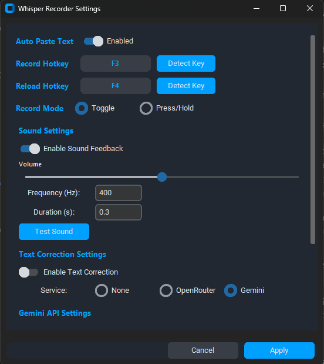
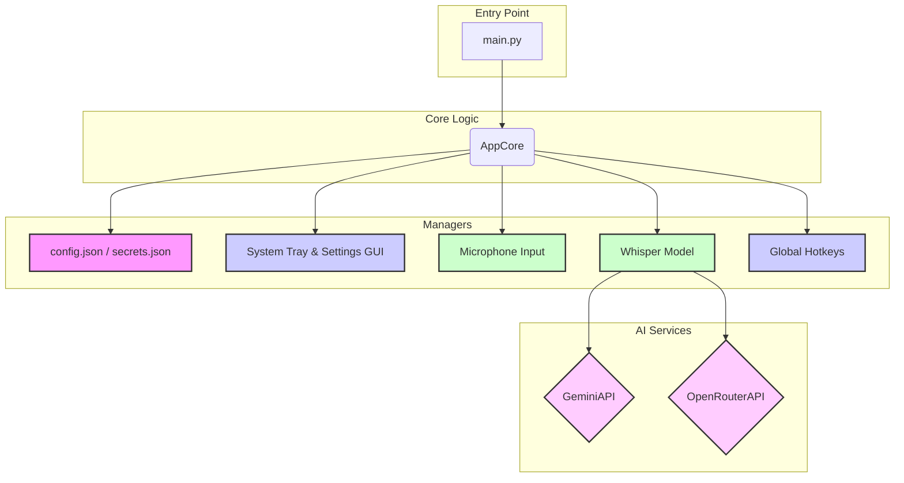

# Whisper Transcription App

A lightweight, high-performance desktop tool for Windows that turns your speech into text using OpenAI's Whisper model. It offers optional integration with Google Gemini or OpenRouter to automatically polish the output, providing superior punctuation and grammar.



## Table of Contents

1.  [Features](#features)
2.  [System Architecture](#system-architecture)
3.  [Auto Recording System](#auto-recording-system)
4.  [Installation](#installation)
5.  [Configuration](#configuration)
6.  [Usage](#how-to-use-the-app)
7.  [Troubleshooting](#troubleshooting)
8.  [Contributing](#contributing)
9.  [License](#license)

## Features

*   **High-Quality Transcription:** Powered by the `openai/whisper-large-v3-turbo` model for state-of-the-art speech recognition.
*   **GPU Acceleration:** Automatically utilizes your NVIDIA GPU (if available) for significantly faster transcriptions, with fallback to CPU.
*   **Dynamic Performance:** Intelligently adjusts batch sizes based on available VRAM for optimal performance.
*   **Customizable Hotkeys:**
    *   Activate recording with a global hotkey that works anywhere in Windows.
    *   Supports both **Toggle Mode** (press once to start, press again to stop) and **Hold Mode** (record only while the key is held down).
    *   Dedicated "Agent Mode" hotkey for special commands.
*   **AI-Powered Text Correction (Optional):**
    *   Integrates with **Google Gemini** or **OpenRouter** to automatically correct punctuation, grammar, and remove speech disfluencies.
    *   Prompts are fully customizable through the settings GUI.
*   **Agent Mode:** Use a separate hotkey to process your speech with a different, customizable prompt (e.g., "translate this to English", "summarize this text").
*   **User-Friendly Interface:**
    *   Runs discreetly in the system tray, showing the current status via icon colors.
    *   An intuitive GUI for managing all settings without editing files.
    *   Quickly switch between Gemini models directly from the tray menu.
*   **Auditory Feedback:** Optional sound cues for starting and stopping recording.
*   **Automatically remove silent sections** using the Silero VAD. Initialization uses `onnxruntime` with automatic selection of `CUDAExecutionProvider` when available, falling back to `CPUExecutionProvider`.
*   **Model awareness:** the settings UI shows the download size of each Whisper model and whether it is already installed, scanning the local cache, global Hugging Face cache, and custom model directories.
*   **Robust and Stable:** Includes a background service to ensure hotkeys remain responsive, a common issue on Windows 11.
*   **Launch at Startup Option:** Start the application automatically when Windows boots.
*   **Unified `TRANSCRIBING` State:** recording, Whisper processing, and optional AI correction all occur while the application remains in this state. Once the final text is ready, the state returns to `IDLE`.

## System Architecture

The application is built with a modular architecture to separate concerns, making it easier to maintain and extend.



*   **`main.py`**: The entry point that initializes and runs the application.
*   **`AppCore`**: The central brain, coordinating all other modules and managing the application's state.
*   **`ConfigManager`**: Loads and saves all user settings from `config.json` and `secrets.json`.
*   **`UIManager`**: Manages all GUI elements, including the system tray icon and the settings window.
*   **`AudioHandler`**: Manages microphone input, recording, and sound feedback.
*   **`TranscriptionHandler`**: Manages the Whisper model, runs the transcription pipeline, and coordinates with AI correction services.
*   **`KeyboardHotkeyManager`**: Listens for and handles global hotkeys.
*   ****`GeminiAPI` / `OpenRouterAPI`**: Clients for interacting with external AI services and text correction. Both expose the method `reinitialize_client()` to reload key and model at runtime.

## Auto Recording System

The application features a flexible automatic approach to storing captured audio. Depending on the selected mode, recordings may remain in memory for quick processing or be written to temporary files to save RAM. In **auto** mode, audio is kept in memory up to a configurable duration and automatically offloaded to disk if free memory becomes scarce. This reduces disk wear while ensuring stability during long sessions.

### Configuration Parameters

* `record_storage_mode` – Choose `"memory"`, `"disk"`, or `"auto"` (default). Auto uses memory whenever possible and falls back to the file system when limits are exceeded.
* `max_memory_seconds_mode` – `"manual"` (default) uses the value of `max_memory_seconds`. Set to `"auto"` to compute a limit based on free RAM at the start of each recording.
* `max_memory_seconds` – Maximum length of audio (in seconds) to keep in RAM before switching to disk.
* `min_free_ram_mb` – Minimum free RAM required to continue storing audio in memory. If available memory drops below this value, the app writes new chunks directly to disk until memory usage is safe again.
* **Automatic RAM safeguard:** while recording, if free RAM falls below 10% of total system memory, new audio is redirected to disk even in memory mode.
* `record_storage_limit` – Maximum number of temporary recordings to keep. Older recordings are deleted when this limit is exceeded.

### Example

```json
{
    "record_storage_mode": "auto",
    "max_memory_seconds_mode": "auto",
    "max_memory_seconds": 30,
    "min_free_ram_mb": 1000
}
```

Long recordings consume roughly 64 KB of RAM per second (16-bit mono at 16 kHz). Adjust the values above based on your system's memory capacity. When storing to disk, temporary files are deleted automatically after transcription.

## Installation

Follow these steps carefully to get the app running on your Windows computer.

### Step 1: Install Prerequisites

You need to install two essential tools before setting up the application:

1.  **Install Python 3.9 or higher:**
    *   Python is the programming language the application is built with.
    *   Go to the official Python website: [https://www.python.org/downloads/](https://www.python.org/downloads/)
    *   Download the latest version of Python 3.9 or newer for Windows.
    *   Run the downloaded installer.
    *   **VERY IMPORTANT:** On the first screen of the installer, make sure to check the box that says **"Add Python to PATH"**. This step is crucial! If you miss this, you won't be able to run Python commands easily from your terminal. If you forget, you might need to uninstall and reinstall Python.
    *   Follow the rest of the installer prompts (usually clicking "Next" or "Install").
    *   **Verification:** To check if Python was installed correctly and added to PATH, open your Command Prompt (search for `cmd` in the Windows search bar) and type:
        ```bash
        python --version
        ```
        Press Enter. You should see the Python version number printed. If you get an error like " 'python' is not recognized...", Python was not added to PATH correctly.

2.  **Install Git:**
    *   Git is a version control system used to download the project files from GitHub.
    *   Go to the Git website: [https://git-scm.com/downloads](https://git-scm.com/downloads)
    *   Download the installer for Windows.
    *   Run the downloaded installer. You can usually accept the default options during installation.
    *   **Verification:** To check if Git was installed correctly, open your Command Prompt and type:
        ```bash
        git --version
        ```
        Press Enter. You should see the Git version number printed.

### Step 2: Download the Application Code

Now that you have Python and Git installed, you can download the application code from GitHub.

1.  **Open your terminal:** Open Command Prompt or PowerShell.
2.  **Clone the repository:** Run the following command. This will download all the project files into a new folder named `whisper-flash-transcriber` in your current location.
    ```bash
    git clone https://github.com/AliasUruz/whisper-flash-transcriber.git
    ```

3.  **Navigate to the project directory:** Change your current working directory in the terminal to the folder you just cloned:
    ```bash
    cd whisper-flash-transcriber
    ```
    Your terminal prompt should now show that you are inside the `whisper-flash-transcriber` folder.

### Step 3: Set up a Virtual Environment (Best Practice!)

Setting up a virtual environment is highly recommended. It creates an isolated space for this project's Python libraries, preventing them from interfering with libraries used by other Python projects on your computer.

1.  **Create the virtual environment:** While inside the `whisper-flash-transcriber` directory in your terminal, run:
    ```bash
    python -m venv venv
    ```
    This command creates a folder named `venv` inside your project directory, which contains the virtual environment files.

2.  **Activate the virtual environment:** You need to activate the virtual environment in each terminal session you use for this project.
    *   **On Windows Command Prompt:**
        ```bash
        .\venv\Scripts\activate
        ```
    *   **On Windows PowerShell:**
        ```bash
        .\venv\Scripts\Activate.ps1
        ```
    *   **On Git Bash or other Unix-like shells (like in VS Code terminal):**
        ```bash
        source venv/bin/activate
        ```
    After activation, your terminal prompt should change to include `(venv)` at the beginning, like `(venv) C:\path\to\whisper-flash-transcriber>`. This indicates that the virtual environment is active.

### Step 4: Install Application Dependencies

With your virtual environment activated, you can now install the libraries the application needs to run. These are listed in the `requirements.txt` file.

1.  **Install dependencies:** Run the following command in your activated terminal:
    ```bash
    pip install -r requirements.txt
    ```
The `pip` command is Python's package installer. The `-r requirements.txt` part tells pip to install everything listed in that file. This step will download and install all necessary packages, including large ones like `torch` and `transformers`. This might take several minutes depending on your internet speed.

2.  **Optional: Install CTranslate2 backend (via faster-whisper):**
    These packages provide an alternative Whisper backend powered by CTranslate2 through the `faster-whisper` library. They require AVX2 support or a recent GPU and may fail on older CPUs. Install them only if your hardware supports these features.
    ```bash
    pip install -r requirements-optional.txt
    ```

3.  **Optional: Install PyTorch with CUDA (For GPU Acceleration):**
    The `requirements.txt` includes a basic installation of PyTorch. However, if you have a compatible NVIDIA graphics card, you can significantly speed up the transcription process by installing a version of PyTorch that uses your GPU (CUDA).
    *   **How to check if you have CUDA:** Open Command Prompt and type `nvcc --version`. If you see version information, CUDA is installed. Note the version number (e.g., CUDA 11.8, CUDA 12.1). If the command is not found, you likely don't have CUDA installed or it's not in your PATH.
    *   **Get the correct command:** Go to the official PyTorch website's installation section: [https://pytorch.org/get-started/locally/](https://pytorch.org/get-started/locally/)
    *   Select your operating system (Windows), Package (Pip), Language (Python), and importantly, your CUDA version (or select "CPU" if you don't have a compatible GPU).
    *   Copy the provided installation command and run it in your **activated virtual environment**.
    *   **Example (for Windows, Pip, Python, CUDA 11.8):**
        ```bash
        pip install torch torchvision torchaudio --index-url https://download.pytorch.org/whl/cu118
        ```
    *   This command will download and install the GPU-accelerated version of PyTorch. It's a large download. If you already installed the CPU version via `requirements.txt`, this command will upgrade it.
    *   If you do *not* have a compatible GPU or prefer not to use it, you can skip this step. The application will still work using your CPU, just slower.

4.  **Optional: Install onnxruntime-gpu (for VAD acceleration):**
    The VAD relies on **ONNX Runtime**. While `requirements.txt` installs the CPU version (`onnxruntime`), you can install `onnxruntime-gpu` if you own a compatible GPU to speed up voice detection. The application automatically selects `CUDAExecutionProvider` when available or falls back to `CPUExecutionProvider`.

### Step 5: Run the Application

You are now ready to run the Whisper Transcription App!

**Important:** make sure you ran `pip install -r requirements.txt` before executing the command below.

1.  **Start the main script:** In your **activated virtual environment** within the `whisper-flash-transcriber` directory, run:
    ```bash
    python src/main.py
    ```
    This command executes the main application file.
2.  **Application Window:** A graphical window should appear. This is the application's main interface.
3.  **System Tray Icon:** The application will likely minimize to your Windows system tray (near the clock). You can usually interact with it by right-clicking the icon.
4.  **Model Download Prompt:** On first launch, if the selected Whisper model isn't installed, the app will ask before downloading it. You can always install or switch models later from the settings menu.

## Configuration

The application's settings are managed through its graphical interface and stored in two files: `config.json` (for general settings) and `secrets.json` (for sensitive API keys). These files are automatically created the first time you run `src/main.py`.

To access and change settings:

1.  Run the application (`python src/main.py`).
2.  Look for a "Settings" or "Configuration" option within the application window or by right-clicking the system tray icon. Click it to open the settings window.

### Key Configuration Options:

* **ASR Settings Panel:** The ASR view now starts with the essential model and device selectors. Click the `Mostrar avancado` button to expose backend, dtype, quantization and cache controls.
*   **Hotkey:** Change the keyboard shortcut used to start and stop recording. The default is F3. Choose a key combination that doesn't conflict with other applications you use frequently.
*   **Agent Hotkey:** A separate hotkey (default F4) to activate "Agent Mode".
*   **Recording Mode:** Choose between "Toggle" (press to start, press to stop) or "Hold" (record while key is pressed).
*   **Auto-Paste:** If enabled, transcribed text is automatically pasted into the last active window.
*   **Enable Hotkey Stability Service:** Activates a background service to improve hotkey responsiveness on Windows 11.
*   **Launch at Startup:** Automatically runs the application when you log into Windows.
*   **Sound Settings:** Configure sound feedback for recording start/stop (enable/disable, frequency, duration, volume).
*   **Enable Text Correction:** Check this box if you want to use an external AI model (OpenRouter or Gemini) to improve the transcribed text.
*   **Text Correction Service:** If text correction is enabled, select whether you want to use "OpenRouter" or "Google Gemini".
*   **API Key:** This is where you enter the API key for the text correction service you selected. **Keep your API keys private!** They are stored locally in `secrets.json`, which is ignored by Git.
    *   **How to get an OpenRouter API Key:** Visit [https://openrouter.ai/](https://openrouter.ai/) and sign up or log in. You can generate API keys from your account dashboard.
    *   **How to get a Google Gemini API Key:** Visit [https://makersuite.google.com/app/apikey](https://makersuite.google.com/app/apikey) and generate a new API key.
*   **Model:** For text correction, choose one of the available models for the selected service (e.g., "deepseek/deepseek-chat-v3-0324:free" on OpenRouter or "gemini-2.5-flash" on Gemini).
*   **Gemini Correction Prompt:** Customize the prompt sent to Gemini for text correction.
*   **Agent Mode Prompt:** Customize the prompt sent to Gemini when using "Agent Mode".
*   **Gemini Models (one per line):** Manage the list of available Gemini models in the dropdown.
*   **ASR Compute Device:** Choose "Auto-select (Recommended)", "Force CPU", or a specific "GPU" for transcription.
*   **Batch Size:** Configure the batch size for transcription.
*   **Chunk Length (s):** Controls how long each audio segment sent to Whisper is. Smaller values reduce memory use but may slow processing.
*   **Record Storage Mode:** Choose between always using memory, always using disk, or automatically selecting based on free RAM.
*   **Minimum Free RAM (MB):** Threshold used in auto mode to decide when audio can be stored in memory.
*   **Max Memory Seconds Mode:** Set to "auto" to adjust the retention limit dynamically or "manual" to use a fixed value.
*   **Max Memory Seconds:** Limits the amount of audio kept in RAM when auto mode is active.
*   **Save Temporary Recordings:** When enabled, the captured audio is stored as `temp_recording_<timestamp>.wav` in the application folder. This temporary file is automatically deleted once transcription completes.
*   **Display Transcript in Terminal:** Show the final text in the terminal window after each recording.
*   **Use VAD:** enables silence removal without automatically stopping the recording.
*   **VAD Threshold:** sensitivity of voice detection.
*   **VAD Silence Duration (s):** maximum pause length to keep; longer silences are trimmed.
*   **Silero VAD Status:** indicates whether the VAD model is installed; the checkbox is disabled when the model file is missing.

### ASR Backend Configuration

The speech recognition engine supports multiple backends. The following keys in `config.json` control how the model is loaded:

| Key | Description | Example |
| --- | ----------- | ------- |
| `asr_model_id` | Model identifier to download. | `"openai/whisper-large-v3-turbo"` |
| `asr_backend` | Backend implementation (`transformers` or `ct2`). The value `faster-whisper` is accepted as an alias for `ct2`. | `"transformers"` |
| `asr_compute_device` | Target device such as `cpu`, `cuda:0`, or `auto`. | `"cuda:0"` |
| `asr_dtype` | Numerical precision (`float16`, `float32`, ...). | `"float16"` |
| `asr_ct2_compute_type` | Compute type for the CTranslate2 backend. | `"default"` |
| `asr_cache_dir` | Optional path to cache downloaded models. | `"/models"` |

> **Note:** When loading settings, the application normalizes backend names.
Values such as `faster-whisper` or `ctranslate2` are automatically mapped to
`ct2`.

#### Further reading

- **ASR Backend:** [Transformers documentation](https://huggingface.co/docs/transformers/index) and [CTranslate2 documentation](https://opennmt.net/CTranslate2/).
- **Quantization:** [CTranslate2 quantization guide](https://opennmt.net/CTranslate2/quantization.html).
- **ASR DType:** [PyTorch tensor data types](https://pytorch.org/docs/stable/tensors.html#data-types).
- **CT2 Compute Type:** [CTranslate2 compute type options](https://opennmt.net/CTranslate2/README.html#compute-types).

Examples:

```json
{
  "asr_backend": "transformers",
  "asr_compute_device": "cpu",
  "asr_dtype": "float32"
}
```

```json
{
  "asr_backend": "ct2",
  "asr_compute_device": "cuda:0",
  "asr_dtype": "float16",
  "asr_ct2_compute_type": "default"
}
```

Install `flash-attn` to enable FlashAttention&nbsp;2 for the Transformers backend:

```
pip install flash-attn --no-build-isolation
```

If the library is missing, the application automatically falls back to standard attention.

Using a shorter **Chunk Length** lowers GPU memory usage but increases overhead because more segments need to be processed. Longer chunks speed up transcription at the cost of higher memory consumption.


### Displaying Transcripts in the Terminal

Set `display_transcripts_in_terminal` to `true` in `config.json` or toggle the option in the settings window to print the full transcript in the terminal after each recording.


### Hotkey Config File

Hotkey settings are stored in `hotkey_config.json`. Only the following keys are recognized:

```json
{
    "record_key": "f3",
    "agent_key": "f4",
    "record_mode": "toggle"
}
```

Remember to save your changes in the settings window.

## How to Use the App

Once the application is running and configured:

1.  **Ensure the app is running:** Check for its icon in the system tray.
2.  **Open the application where you want to paste text:** This could be Notepad, Word, your web browser, etc.
3.  **Press your Hotkey:** Press the hotkey you configured (default F3). The application starts listening. Speak clearly into your microphone.
4.  **Press the Hotkey Again:** Press the *same* hotkey to stop recording.
5.  **Wait for Transcription:** The application will process the audio. This might take a few moments depending on the length of the recording and whether you are using CPU or GPU for transcription. If text correction is enabled, it will also communicate with the API.
6.  **Text Appears:** The transcribed (and corrected) text will automatically appear in the application window that was active when you stopped recording.

## Safe Shutdown

The application terminates immediately and safely when closed. Even if a transcription is still running, the executor shuts down to prevent zombie processes.

## Performance Flags and Metrics

This release adds performance flags and metric logs to support optimization and diagnostics.

Configuration Flags
- enable_torch_compile: enables PyTorch optimizations when applicable. Default: false.
- chunk_length_mode: "manual" or "auto". In auto mode, chunk_length_sec is recalculated based on free VRAM.
- chunk_length_sec: chunk duration in seconds, affecting memory and throughput.
- batch_size: base value for dynamic batch calculation (may vary with VRAM).
- auto_ram_threshold_percent: when recording to memory, switches to disk if free RAM falls below this percentage (1–50). Default: 10.
- display_transcripts_in_terminal: prints the final transcription to the terminal.

Metrics [METRIC]
All metrics are emitted via logging with the [METRIC] prefix for easy filtering.

- t_pre, t_infer, t_post, segment_total  
  Example: [METRIC] stage=t_infer value_ms=123.45 device=cuda:0 chunk=30.0 batch=16 dtype=fp16 attn=flash_attn2  
  Default fields: stage, value_ms, device (cpu/cuda:N), chunk (s), batch, dtype (fp16/fp32), attn (flash_attn2/sdpa).

- warmup_infer  
  Example: [METRIC] stage=warmup_infer value_ms=85.2

- gpu_autoselect  
  Example: [METRIC] stage=gpu_autoselect gpu=0 free_gb=9.75 total_gb=12.00

- attn_impl, attn_impl_effective  
  Example: [METRIC] stage=attn_impl value=flash_attn2

- record_thread_finalize, record_stop_overhead  
  Example: [METRIC] stage=record_stop_overhead value_ms=3.1

- ram_to_disk_migration  
  Example: [METRIC] stage=ram_to_disk_migration reason=low_free_ram percent_free=8.5 threshold=10

- empty_cache  
  Example: [METRIC] stage=empty_cache value_ms=4.2 freed_estimate_mb=128.0

- oom_recovery  
  Example: [METRIC] stage=oom_recovery action=reduce_batch from=16 to=8

Best Practices
- Larger chunks speed up transcription but consume more memory. On systems with 8–12GB of VRAM, 30–45s with FP16 tends to be efficient.
- If an OOM occurs, the system attempts to reduce batch size and, if necessary, chunk length for subsequent submissions.
- On CPU, prefer smaller chunks (15–20s) and reduced batch sizes.

## Troubleshooting

### VAD crash when recording with silence detection enabled
- Update to the latest build; the audio pipeline now normalizes each chunk before sending it to the Silero VAD model.
- If the issue persists, grab the newest entry from `logs/vad_failure.jsonl` and share it when reporting the bug.

### Terminal prints stray ESC characters
- Standard output now strips ANSI escape sequences and disables progress-bar color codes by default.
- If a custom launcher re-enables colored logs, wrap its stdout the same way or set `HF_HUB_DISABLE_PROGRESS_BARS=1`.

### Hotkeys Stop Working on Windows 11

This is a known issue related to the underlying libraries. If your main hotkey (default F3) stops working after the first use, try these solutions:

*   **Press the Agent Hotkey (Default: F4):** The application includes a secondary hotkey specifically to try and fix this. Press F4.
*   **Use the System Tray Menu:** Right-click the application's icon in the system tray and look for an option like "Force Hotkey Re-registration".
*   **Automatic Reload:** The app attempts to automatically handle this in the background, but manual intervention might sometimes be needed.

### PyTorch Installation Problems

If `pip install -r requirements.txt` fails or the application doesn't run due to PyTorch errors:

*   **Verify Python and Pip:** Ensure Python is correctly installed and added to your PATH (check with `python --version` and `pip --version` in Command Prompt).
*   **Virtual Environment:** Make sure your virtual environment is activated (`(venv)` in your terminal prompt).
*   **CUDA Compatibility:** If you are trying to install the CUDA version, double-check that your NVIDIA driver and CUDA toolkit versions are compatible with the PyTorch version you are trying to install, according to the PyTorch website.
*   **Internet Connection:** Ensure you have a stable internet connection, as PyTorch and other libraries are large downloads.

### FlashAttention 2 Not Installed

The model loader checks for the optional `flash-attn` library. If it is missing, the app automatically falls back to the standard attention implementation, so installation of `flash-attn` is not required.

### "state_check_callback" Error

If you encounter the message `AttributeError: 'TranscriptionHandler' object has no attribute 'state_check_callback'`,
update to the latest version. The attribute is now properly initialized in `TranscriptionHandler.__init__`.

### Stop Signal Replaces Cancellation

Transcription can now be halted at any moment by sending a **stop signal** to `TranscriptionHandler`. The previous cancellation method and its related callback have been removed to simplify the API and improve reliability.

## Contributing

Contributions are welcome! If you have ideas for improvements, bug fixes, or new features, please:

1.  Fork the repository on GitHub.
2.  Create a new branch for your changes.
3.  Make your changes and commit them with clear messages.
4.  Push your changes to your fork.
5.  Open a Pull Request from your fork to the original repository's `master` branch.
6.  Describe your changes and why they should be included.
7.  Optionally, run `flake8 src/gemini_api.py src/openrouter_api.py` to check code style.

## License

This project is open-source and licensed under the MIT License. You can find the full legal text in the `LICENSE` file included in this repository. This means you are free to use, copy, modify, and distribute the software.

## Support

If you need help, encounter bugs, or have questions:

1.  **Check the Troubleshooting section:** Review the common issues listed above.
2.  **Open a GitHub Issue:** The best way to get support is to open a new issue on the repository's GitHub page: [https://github.com/AliasUruz/whisper-flash-transcriber/issues](https://github.com/AliasUruz/whisper-flash-transcriber/issues). Please provide as much detail as possible about your problem, including your operating system, Python version, steps to reproduce the issue, and any error messages.
