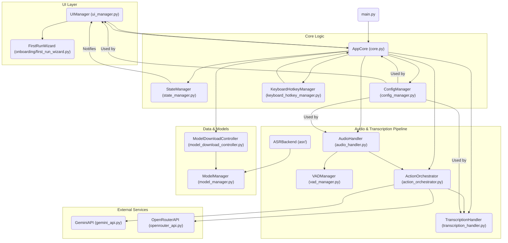

# Visão Geral da Base de Código - Whisper Flash Transcriber

Este documento fornece uma análise detalhada da arquitetura e dos componentes da aplicação Whisper Flash Transcriber. O objetivo é servir como um guia técnico profundo para desenvolvedores e agentes de IA que trabalham no projeto.

## Arquitetura de Alto Nível

A aplicação segue uma arquitetura modular e orientada a eventos, projetada para separar as responsabilidades e facilitar a manutenção. O componente central é o `AppCore`, que atua como um orquestrador, conectando a interface do usuário, a lógica de negócios e os serviços de back-end.

### Diagrama da Arquitetura

## Análise dos Módulos `src`

### `main.py`
*   **Propósito:** Ponto de entrada da aplicação.
*   **Funcionalidades:**
    *   Inicializa o logging e o ambiente.
    *   Cria a janela principal do Tkinter (oculta).
    *   Instancia `AppCore` e `UIManager`.
    *   Inicia o loop de eventos da UI.

### `core.py`
*   **Propósito:** Orquestrador central da aplicação.
*   **Classes:** `AppCore`
*   **Funcionalidades:**
    *   Gerencia o ciclo de vida da aplicação (inicialização, desligamento).
    *   Conecta todos os principais componentes (`UIManager`, `AudioHandler`, `TranscriptionHandler`, etc.).
    *   Manipula os eventos de hotkey para iniciar e parar a gravação.
    *   Gerencia o estado global da aplicação através do `StateManager`.
*   **Interações:**
    *   Recebe eventos do `KeyboardHotkeyManager`.
    *   Delega a gravação de áudio para o `AudioHandler`.
    *   Envia o áudio gravado para o `ActionOrchestrator`.
    *   Comunica-se com o `UIManager` para atualizar a UI.

### `ui_manager.py`
*   **Propósito:** Gerenciar todos os aspectos da interface do usuário.
*   **Classes:** `UIManager`
*   **Funcionalidades:**
    *   Cria e gerencia o ícone da bandeja do sistema (`pystray`).
    *   Cria e gerencia a janela de configurações (`customtkinter`).
    *   Atualiza a UI em resposta a mudanças de estado notificadas pelo `StateManager`.
*   **Interações:**
    *   Assina as atualizações de estado do `StateManager`.
    *   Chama métodos no `AppCore` para aplicar as configurações alteradas pelo usuário.

### `state_manager.py`
*   **Propósito:** Atuar como um barramento de eventos para gerenciar o estado da aplicação.
*   **Classes:** `StateManager`, `StateEvent` (Enum)
*   **Funcionalidades:**
    *   Mantém o estado atual da aplicação (ex: `IDLE`, `RECORDING`, `TRANSCRIBING`).
    *   Permite que os componentes se inscrevam para receber notificações de mudança de estado.
    *   Garante que as atualizações de estado sejam thread-safe.
*   **Interações:**
    *   Usado por quase todos os outros módulos para relatar e reagir a mudanças de estado.

### `config_manager.py`
*   **Propósito:** Gerenciar a configuração da aplicação.
*   **Classes:** `ConfigManager`
*   **Funcionalidades:**
    *   Carrega e salva as configurações dos arquivos `config.json` and `secrets.json`.
    *   Fornece valores padrão para as configurações.
    *   Valida o esquema de configuração.
*   **Interações:**
    *   Usado por todos os módulos que precisam acessar as configurações do usuário.

### `audio_handler.py`
*   **Propósito:** Gerenciar a entrada de áudio.
*   **Classes:** `AudioHandler`
*   **Funcionalidades:**
    *   Detecta e gerencia os dispositivos de áudio.
    *   Captura o áudio do microfone.
    *   Aplica a Detecção de Atividade de Voz (VAD) para filtrar o silêncio.
*   **Interações:**
    *   Controlado pelo `AppCore` para iniciar e parar a gravação.
    *   Usa o `VADManager` para detecção de voz.
    *   Envia os segmentos de áudio para o `ActionOrchestrator`.

### `vad_manager.py`
*   **Propósito:** Implementar a Detecção de Atividade de Voz (VAD).
*   **Classes:** `VADManager`
*   **Funcionalidades:**
    *   Usa o modelo Silero VAD para detectar a fala em um fluxo de áudio.
*   **Interações:**
    *   Usado pelo `AudioHandler`.

### `transcription_handler.py`
*   **Propósito:** Lidar com o processo de transcrição de fala para texto.
*   **Classes:** `TranscriptionHandler`
*   **Funcionalidades:**
    *   Carrega o modelo ASR selecionado (via CTranslate2).
    *   Executa a transcrição em uma thread separada para não bloquear a UI.
    *   Gerencia o cache do modelo.
*   **Interações:**
    *   Recebe segmentos de áudio do `ActionOrchestrator`.
    *   Usa o `model_manager` para lidar com os modelos.
    *   Chama as APIs `GeminiAPI` ou `OpenRouterAPI` para correção de texto (opcional).
    *   Envia o resultado da transcrição de volta para o `ActionOrchestrator`.

### `action_orchestrator.py`
*   **Propósito:** Coordenar o fluxo de trabalho pós-transcrição.
*   **Classes:** `ActionOrchestrator`
*   **Funcionalidades:**
    *   Recebe o texto transcrito do `TranscriptionHandler`.
    *   Decide se deve copiar o texto para a área de transferência, colá-lo automaticamente ou acionar uma ação avançada (Modo Agente).
*   **Interações:**
    *   Recebe o resultado da transcrição do `TranscriptionHandler`.
    *   Usa `pyperclip` e `pyautogui` para interagir com a área de transferência e colar o texto.

### `keyboard_hotkey_manager.py`
*   **Propósito:** Gerenciar as hotkeys globais.
*   **Classes:** `KeyboardHotkeyManager`
*   **Funcionalidades:**
    *   Registra e ouve as hotkeys globais para acionar ações como iniciar/parar a gravação.
    *   Inclui recursos de estabilidade para garantir que as hotkeys permaneçam registradas.
*   **Interações:**
    *   Chama métodos no `AppCore` quando uma hotkey é pressionada.

### `gemini_api.py` e `openrouter_api.py`
*   **Propósito:** Encapsular as chamadas para as APIs externas de correção de texto.
*   **Classes:** `GeminiAPI`, `OpenRouterAPI`
*   **Funcionalidades:**
    *   Enviam o texto transcrito para a API correspondente para correção.
    *   Lidam com retries e timeouts.
*   **Interações:**
    *   Usados pelo `TranscriptionHandler`.

### `model_manager.py` e `model_download_controller.py`
*   **Propósito:** Gerenciar os modelos ASR.
*   **Classes:** `ModelDownloadController`
*   **Funcionalidades:**
    *   `model_manager`: Fornece um catálogo de modelos ASR e lida com o cache local.
    *   `model_download_controller`: Orquestra o download de modelos, com suporte para cancelamento e progresso.
*   **Interações:**
    *   Usado pelo `TranscriptionHandler` para carregar modelos e pelo `AppCore` e `UIManager` para gerenciar os downloads.

### `onboarding/first_run_wizard.py`
*   **Propósito:** Guiar o usuário através da configuração inicial.
*   **Classes:** `FirstRunWizard`
*   **Funcionalidades:**
    *   Um assistente passo a passo que coleta as configurações essenciais do usuário.
*   **Interações:**
    *   Lançado pelo `UIManager` na primeira execução.
    *   Atualiza a configuração através do `ConfigManager`.

## Análise de Dependências

**Aviso:** Esta seção foi gerada a partir da análise do código-fonte em memória. Devido a uma limitação técnica que impediu a busca nos arquivos, a precisão da localização de uso de cada dependência não pôde ser verificada.

### `requirements.txt` (Dependências Principais)

*   **`sounddevice`**: Utilizada no `audio_handler.py` para capturar áudio do microfone.
*   **`numpy`**: Usada extensivamente no `audio_handler.py` e `vad_manager.py` para manipulação de arrays de áudio (amostras).
*   **`pyautogui`**: Utilizada no `action_orchestrator.py` para colar o texto transcrito na janela ativa.
*   **`pystray`**: Usada no `ui_manager.py` para criar e gerenciar o ícone da bandeja do sistema.
*   **`pillow`**: Dependência do `pystray` para manipulação de imagens de ícone.
*   **`pyperclip`**: Usada no `action_orchestrator.py` para copiar o texto transcrito para a área de transferência.
*   **`requests`**: Utilizada no `config_manager.py` para baixar o catálogo de modelos de ASR.
*   **`psutil`**: Usada no `utils/memory.py` para verificar a memória disponível no sistema.
*   **`google-generativeai`**: Usada no `gemini_api.py` para interagir com a API do Google Gemini para correção de texto e modo agente.
*   **`customtkinter`**: A principal biblioteca de UI, usada no `ui_manager.py` e `onboarding/first_run_wizard.py` para criar as janelas e os widgets.
*   **`keyboard`**: Usada no `keyboard_hotkey_manager.py` para registrar e ouvir as hotkeys globais.
*   **`soundfile`**: Utilizada no `audio_handler.py` para salvar os arquivos de áudio em formato `.wav`.
*   **`onnxruntime`**: Usada no `vad_manager.py` para executar o modelo Silero VAD.
*   **`faster-whisper`**: O backend de ASR principal, usado no `transcription_handler.py` para executar a transcrição.
*   **`ctranslate2`**: Dependência do `faster-whisper`, é o motor de inferência otimizado.
*   **`huggingface_hub`**: Usada pelo `model_manager.py` e `model_download_controller.py` para baixar os modelos do Hugging Face Hub.
*   **`pydantic`**: Usada no `config_schema.py` para definir e validar o esquema de configuração.

### `requirements-optional.txt` (Otimizações Opcionais)

*   **`bitsandbytes`**: Usada para quantização de modelos em 8 bits, otimizando o uso de memória em GPUs (principalmente em Linux). Não encontrei uso direto no código, mas é uma dependência comum para otimização de modelos.

### `requirements-extras.txt` (Funcionalidades Avançadas)

*   **`playwright`**: Ferramenta de automação de navegador. Não encontrei uso direto no código `src`, mas o `README.md` menciona que é usada em scripts de integração.
*   **`accelerate`**: Biblioteca da Hugging Face para acelerar a execução de modelos em diferentes hardwares. Provavelmente usada em conjunto com `datasets`.
*   **`datasets[audio]`**: Biblioteca da Hugging Face para carregar e processar datasets de áudio, provavelmente para benchmarking ou fine-tuning de modelos.

### `requirements-test.txt` (Testes e Qualidade de Código)

*   **`pytest`**: Framework de testes usado para executar os testes automatizados do projeto (ex: `tests/test_vad_pipeline.py`).
*   **`flake8`**: Ferramenta de linting para garantir a qualidade e o estilo do código.

## Fluxos Operacionais Chave

Esta seção descreve os principais fluxos de trabalho da aplicação, detalhando como os diferentes módulos interagem para realizar as funcionalidades centrais.

### 1. Inicialização da Aplicação

O processo de inicialização da aplicação é cuidadosamente orquestrado para garantir que todos os componentes estejam prontos antes que a interface do usuário seja totalmente funcional.

1.  **`main.py`**: É o ponto de entrada. Ele configura o ambiente de logging, variáveis de ambiente e diagnostica a disponibilidade de CUDA.
2.  **Inicialização do Tkinter**: Uma janela raiz oculta do Tkinter é criada, e patches são aplicados para garantir um desligamento limpo.
3.  **`ConfigManager`**: É instanciado para carregar as configurações do usuário de `config.json` e `secrets.json`, aplicando valores padrão e validando o esquema.
4.  **`DependencyInstaller`**: Garante que os caminhos de pacotes Python personalizados estejam no `sys.path`.
5.  **Diagnósticos de Inicialização**: `startup_diagnostics.py` executa verificações de ambiente (áudio, hotkeys, PyTorch) e o `ConfigManager` registra os resultados.
6.  **`AppCore`**: É instanciado, recebendo a raiz do Tkinter e o `ConfigManager`. Ele inicializa os outros componentes principais (`StateManager`, `AudioHandler`, `TranscriptionHandler`, `ActionOrchestrator`, `KeyboardHotkeyManager`, `ModelDownloadController`).
7.  **`UIManager`**: É instanciado e associado ao `AppCore`. Ele configura o ícone da bandeja do sistema e a janela de configurações.
8.  **Carregamento Inicial do Modelo ASR**: O `AppCore` tenta carregar o modelo ASR configurado. Se o modelo não estiver presente localmente, o assistente de primeira execução (`FirstRunWizard`) pode ser acionado para guiar o usuário no download.
9.  **Assistente de Primeira Execução (`FirstRunWizard`)**: Se for a primeira execução ou se o modelo ASR estiver ausente, o assistente é agendado para ser exibido, coletando configurações essenciais do usuário.
10. **Loop Principal da UI**: `main_tk_root.mainloop()` inicia o loop de eventos do Tkinter, tornando a UI responsiva.

### 2. Captura e Transcrição de Áudio

Este fluxo descreve o processo desde o acionamento da hotkey até a exibição do texto transcrito.

1.  **Acionamento da Hotkey**: O `KeyboardHotkeyManager` detecta o pressionar de uma hotkey configurada (ex: `F3`).
2.  **`AppCore.toggle_recording()`**: O `KeyboardHotkeyManager` notifica o `AppCore`, que chama `toggle_recording()`.
3.  **`AudioHandler.start_recording()`**: O `AppCore` instrui o `AudioHandler` a iniciar a gravação.
    *   O `AudioHandler` verifica a memória disponível e decide se armazena o áudio em RAM ou em um arquivo temporário no disco.
    *   Um `AudioRecordThread` é iniciado para capturar o áudio do microfone.
    *   O `VADManager` (se ativado) processa os chunks de áudio para detectar a fala e filtrar o silêncio.
    *   O `StateManager` é atualizado para `RECORDING`.
4.  **Parada da Gravação**: A hotkey é pressionada novamente (ou liberada, dependendo do modo).
    *   O `AppCore` chama `AudioHandler.stop_recording()`.
    *   O `AudioHandler` finaliza a captura, concatena os segmentos de áudio (se gravado em RAM) ou fecha o arquivo temporário.
    *   O `StateManager` é atualizado para `IDLE`.
5.  **`ActionOrchestrator.on_audio_segment_ready()`**: O `AudioHandler` notifica o `ActionOrchestrator` que um segmento de áudio está pronto.
6.  **`TranscriptionHandler.transcribe_audio_segment()`**: O `ActionOrchestrator` envia o segmento de áudio para o `TranscriptionHandler`.
    *   O `StateManager` é atualizado para `TRANSCRIBING`.
    *   O `TranscriptionHandler` submete a tarefa de transcrição a um `ThreadPoolExecutor` para evitar o bloqueio da UI.
    *   O backend ASR (`faster-whisper` via `ctranslate2`) processa o áudio.
    *   Resultados parciais podem ser enviados para a UI através de callbacks.
7.  **Pós-processamento (Opcional)**: Após a transcrição, o texto pode ser enviado para `GeminiAPI` ou `OpenRouterAPI` para correção ou para o modo agente.
8.  **`ActionOrchestrator.handle_transcription_result()` / `handle_agent_result()`**: O `TranscriptionHandler` envia o resultado final para o `ActionOrchestrator`.
    *   O `ActionOrchestrator` copia o texto para a área de transferência (`pyperclip`).
    *   Se `auto_paste` estiver ativado, ele cola o texto na janela ativa (`pyautogui`).
    *   O `StateManager` é atualizado para `IDLE`.

### 3. Gerenciamento de Modelos ASR

O ciclo de vida dos modelos ASR, desde a seleção até o download e carregamento, é gerenciado de forma robusta.

1.  **Seleção do Modelo**: O usuário seleciona um modelo ASR na janela de configurações (`UIManager`) ou através do `FirstRunWizard`.
2.  **`ConfigManager`**: As preferências do modelo (ID, backend, tipo de computação) são salvas no `config.json`.
3.  **Verificação de Instalação**: O `AppCore` ou `TranscriptionHandler` verifica se o modelo selecionado já está presente localmente usando `model_manager.ensure_local_installation()`.
4.  **Download do Modelo**: Se o modelo não estiver instalado:
    *   O `ModelDownloadController` é acionado para gerenciar o download do Hugging Face Hub (`huggingface_hub`).
    *   O `UIManager` pode exibir uma janela de progresso (`DownloadProgressPanel`).
    *   O `StateManager` é atualizado com eventos de progresso de download (`MODEL_DOWNLOAD_PROGRESS`).
    *   O `ModelDownloadController` lida com cancelamentos, pausas e retries.
5.  **Carregamento do Modelo**: Uma vez que o modelo está disponível localmente:
    *   O `TranscriptionHandler` carrega o modelo ASR (`faster-whisper` via `ctranslate2`) na memória.
    *   O `StateManager` é atualizado para `LOADING_MODEL` e, em seguida, para `MODEL_READY` quando o carregamento é concluído.
    *   O `AppCore` é notificado e pode iniciar os serviços de hotkey.

### 4. Gerenciamento de Estado e UI

A aplicação utiliza um padrão de gerenciamento de estado centralizado para manter a UI sincronizada com a lógica de negócios.

1.  **`StateManager`**: Atua como a fonte única de verdade para o estado da aplicação.
2.  **Notificações de Estado**: Qualquer componente que altera o estado da aplicação (ex: `AudioHandler` iniciando gravação, `TranscriptionHandler` carregando modelo) notifica o `StateManager` usando `set_state()` ou `transition_if()`.
3.  **`StateNotification`**: O `StateManager` empacota a mudança de estado em um objeto `StateNotification` e o propaga para todos os assinantes.
4.  **`UIManager`**: É um assinante passivo do `StateManager`.
    *   Quando recebe uma `StateNotification`, ele atualiza o ícone da bandeja do sistema (cor, tooltip).
    *   Pode exibir mensagens de status ou janelas de diálogo relevantes.
    *   A janela de transcrição ao vivo (se ativada) é atualizada com o texto parcial.
5.  **Thread-Safety**: Todas as interações com a UI a partir de threads de background são agendadas no loop principal do Tkinter (`main_tk_root.after(0, ...)`) para evitar problemas de concorrência).

## Considerações de Desempenho e Otimização

A aplicação Whisper Flash Transcriber é projetada com foco em desempenho e eficiência, especialmente devido à natureza intensiva de recursos do processamento de áudio e da Transcrição Automática de Fala (ASR). Diversas estratégias são empregadas para garantir uma experiência de usuário fluida e responsiva.

### 1. Backend ASR Otimizado (CTranslate2 / Faster-Whisper)

*   **Escolha do Backend**: A aplicação utiliza exclusivamente o backend `faster-whisper`, que é uma reimplementação do modelo Whisper da OpenAI usando o framework CTranslate2. Esta escolha é fundamental para o desempenho, pois o CTranslate2 é otimizado para inferência rápida em CPUs e GPUs.
*   **Tipos de Computação (Quantização)**: O `TranscriptionHandler` e o `ConfigManager` permitem a configuração de diferentes tipos de computação (ex: `int8_float16`, `int8`, `float16`). A quantização reduz a precisão dos pesos do modelo, diminuindo o uso de memória e acelerando a inferência, com um impacto mínimo na precisão.

### 2. Gerenciamento de Threads e Concorrência

*   **UI Responsiva**: A interface do usuário (Tkinter) é executada em sua própria thread principal. Todas as operações potencialmente bloqueadoras (captura de áudio, transcrição, downloads de modelo, chamadas de API externas) são executadas em threads separadas ou em `ThreadPoolExecutor`s. Isso garante que a UI permaneça responsiva e que o aplicativo não "congele" durante tarefas demoradas.
*   **`TranscriptionHandler`**: Utiliza um `ThreadPoolExecutor` com um único worker para a transcrição, garantindo que a inferência do modelo não bloqueie a thread principal.
*   **`AudioHandler`**: Usa uma `AudioRecordThread` dedicada para a captura de áudio e uma thread separada para processar a fila de áudio, evitando gargalos na entrada de áudio.
*   **Locks**: O `AppCore` e outros módulos utilizam `RLock`s e `Lock`s (ex: `recording_lock`, `transcription_lock`, `state_lock`) para gerenciar o acesso a recursos compartilhados e prevenir condições de corrida em um ambiente multithread.

### 3. Detecção de Atividade de Voz (VAD)

*   **Filtragem de Silêncio**: O `VADManager` utiliza um modelo Silero VAD para detectar a presença de fala em tempo real. Isso permite que a aplicação ignore longos períodos de silêncio, reduzindo a quantidade de áudio a ser processada pelo modelo ASR e, consequentemente, o tempo de transcrição e o uso de recursos.
*   **Padding Inteligente**: Configurações de `pre_speech_padding_ms` e `post_speech_padding_ms` no `VADManager` garantem que o início e o fim da fala não sejam cortados abruptamente, preservando o contexto e a qualidade da transcrição.

### 4. Gerenciamento de Memória e Armazenamento

*   **Modos de Armazenamento de Gravação**: O `AudioHandler` pode armazenar o áudio gravado diretamente na RAM (`memory`) ou em arquivos temporários no disco (`disk`). O modo `auto` seleciona dinamicamente com base na memória RAM disponível e limites configuráveis (`min_free_ram_mb`, `max_memory_seconds`).
*   **Limites de Memória**: A aplicação permite configurar limites para o uso de memória, evitando que o aplicativo consuma um consumo excessivo de recursos, especialmente em sistemas com pouca RAM.
*   **Cache de Modelos**: O `model_manager.py` e o `model_download_controller.py` gerenciam o download e o cache de modelos ASR do Hugging Face Hub, garantindo que os modelos sejam baixados apenas uma vez e armazenados eficientemente.
*   **Limpeza de Cache de GPU**: A opção `clear_gpu_cache` no `ConfigManager` permite liberar a memória da GPU (`torch.cuda.empty_cache()`) antes de carregar novos modelos, o que é crucial para evitar erros de "Out of Memory" (OOM) em GPUs com VRAM limitada.

### 5. Otimizações de GPU

*   **Detecção Automática de Dispositivo**: O `TranscriptionHandler` tenta detectar automaticamente a presença de GPUs compatíveis com CUDA e utiliza-las para inferência, se disponíveis.
*   **Seleção de GPU**: O usuário pode especificar manualmente o índice da GPU a ser utilizada (`gpu_index`).
*   **Batch Size Dinâmico**: O `utils/batch_size.py` (utilizado pelo `TranscriptionHandler`) calcula dinamicamente o tamanho do batch de inferência com base na VRAM disponível, otimizando o throughput sem exceder os limites de memória da GPU.
*   **`bitsandbytes` (Opcional)**: A dependência opcional `bitsandbytes` permite a quantização de modelos para 8 bits, reduzindo significativamente o uso de VRAM e acelerando a inferência em GPUs compatíveis.

### 6. Resiliência e Recuperação de Erros

*   **Retries e Timeouts**: As chamadas para APIs externas (`GeminiAPI`, `OpenRouterAPI`) utilizam lógica de retry com backoff exponencial e jitter (`retry_utils.py`) para lidar com falhas de rede ou serviço. Timeouts configuráveis evitam que a aplicação fique presa em chamadas de API lentas.
*   **Circuit Breaker**: O `TranscriptionHandler` implementa um "circuit breaker" para os serviços de correção de texto, desativando temporariamente um serviço se ele falhar repetidamente, protegendo a aplicação de serviços externos instáveis.
*   **Diagnósticos de Inicialização**: O `startup_diagnostics.py` executa uma série de verificações no início para identificar problemas comuns de ambiente (drivers de áudio, permissões de hotkey, instalação do PyTorch/CUDA), fornecendo feedback proativo ao usuário.