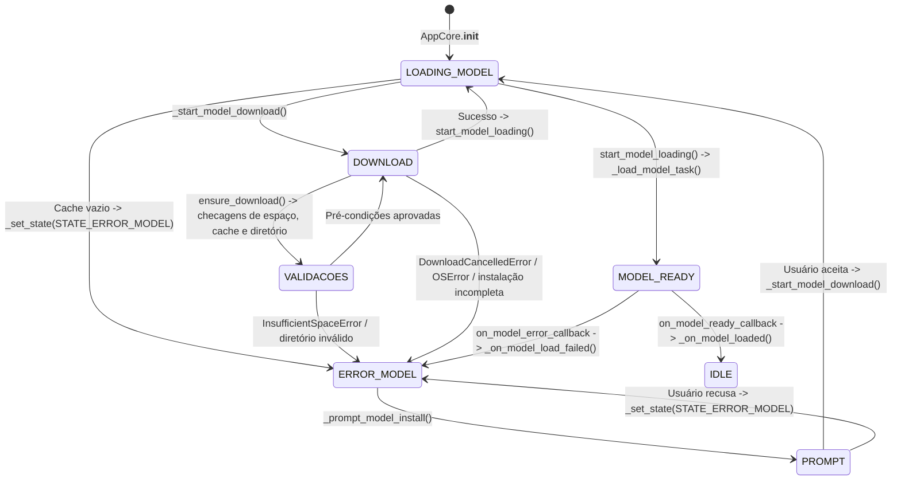

# Ciclo de Download e Carregamento de Modelos

## Escopo
Este documento descreve o encadeamento de chamadas iniciado em `AppCore.__init__` que cobre `_prompt_model_install()`, `_start_model_download()` e `TranscriptionHandler.start_model_loading()`. O objetivo é explicitar como os estados `STATE_LOADING_MODEL`, `STATE_ERROR_MODEL` e `STATE_IDLE` são atualizados via `_set_state()` e propagados para a interface pelo `state_update_callback` do `AppCore`. O fluxo agora também registra metadados estruturados sobre cada tentativa de download, estima o espaço em disco antes de iniciar a transferência e garante a remoção de artefatos incompletos antes de liberar a aplicação de volta ao estado ocioso. 【F:src/core.py†L334-L436】【F:src/model_manager.py†L981-L1254】

## Visão geral das transições de estado
1. O `AppCore` inicia em `STATE_LOADING_MODEL` e imediatamente verifica se o modelo selecionado existe no cache local. Caso o diretório esteja vazio, `_set_state(STATE_ERROR_MODEL)` é chamado antes de solicitar confirmação do usuário para baixar o modelo (`_prompt_model_install()`). 【F:src/core.py†L106-L140】【F:src/core.py†L532-L545】
2. Sempre que `_set_state()` altera `current_state`, a função agenda a execução de `state_update_callback` na *main thread* do Tkinter (`main_tk_root.after`). Com isso, a UI recebe notificações assíncronas sobre `STATE_LOADING_MODEL`, `STATE_ERROR_MODEL` ou `STATE_IDLE`. 【F:src/core.py†L532-L545】
3. Quando um download é autorizado, `AppCore.download_model_and_reload()` instancia um `Event` cancelável, marca o estado como `STATE_LOADING_MODEL` e registra `status=in_progress` com `ConfigManager.record_model_download_status()` antes de chamar `ModelManager.ensure_download()`. Esse método retorna um `ModelDownloadResult` indicando o diretório final e se houve nova transferência. 【F:src/core.py†L334-L408】【F:src/model_manager.py†L981-L1059】
4. `ensure_download()` prepara o diretório alvo, remove resquícios de instalações anteriores, estima tamanho/contagem de arquivos no Hugging Face, checa espaço livre com margem de segurança e aborta com `InsufficientSpaceError` caso não haja armazenamento suficiente. Também registra metadados (`install.json`) quando a instalação já está pronta, evitando re-downloads. 【F:src/model_manager.py†L1032-L1102】
5. Após o download (ou quando o cache já contém os arquivos), `TranscriptionHandler.start_model_loading()` cria `ModelLoadThread`, cujo trabalho é executar `_load_model_task()`. Esse método chama `on_model_ready_callback` ou `on_model_error_callback`, amarrando a finalização do fluxo a `_on_model_loaded()` ou `_on_model_load_failed()` no `AppCore`. 【F:src/transcription_handler.py†L440-L535】【F:src/transcription_handler.py†L658-L675】
6. `_on_model_loaded()` finaliza o caminho feliz sinalizando `STATE_IDLE`, habilitando os hotkeys e gravando `status=success` com o caminho final. Já `_on_model_load_failed()` mantém `STATE_ERROR_MODEL`, persiste `status=error`/`cancelled` e só libera o fluxo quando uma nova tentativa é agendada. 【F:src/core.py†L362-L436】

## Fluxograma Mermaid

## Cenários detalhados
### Caminho feliz
1. O modelo já está no cache ou o usuário confirma o download. `AppCore._set_state(STATE_LOADING_MODEL)` é chamado antes da execução de `ensure_download()` para manter a UI bloqueada enquanto o arquivo é transferido e para atualizar o status persistido para `in_progress`. 【F:src/core.py†L334-L408】
2. Se `ensure_download()` detecta que os artefatos estão completos, grava `install.json`, retorna `downloaded=False` e o núcleo apenas recarrega o backend. Caso contrário, o download roda com barra cancelável, validação de espaço livre e limpeza automática de diretórios incompletos antes de considerar a operação bem-sucedida. 【F:src/model_manager.py†L1032-L1248】
3. Após o download, `TranscriptionHandler.start_model_loading()` inicia `ModelLoadThread`, que termina em `on_model_ready_callback`. Este callback executa `_on_model_loaded()`, define `STATE_IDLE`, registra os hotkeys e atualiza o status para `success` com o caminho final. 【F:src/transcription_handler.py†L440-L535】【F:src/core.py†L362-L408】

### Erro de rede ou falha durante o download
* Qualquer exceção disparada por `ensure_download()` (como perda de conexão, HTTP 403 ou `RuntimeError` por instalação incompleta) cai no bloco `except Exception`, registra `status=error`, exibe mensagem e retorna `STATE_ERROR_MODEL`. O callback de UI continua recebendo `STATE_ERROR_MODEL` até que uma nova tentativa seja feita. 【F:src/core.py†L424-L433】【F:src/model_manager.py†L1181-L1232】

### Cache ausente ou inválido
* Se o diretório configurado estiver vazio, o núcleo já força `STATE_ERROR_MODEL` antes de perguntar ao usuário. Se `TranscriptionHandler._load_model_task()` for acionado com um cache realmente ausente, um `FileNotFoundError` gera `STATE_ERROR_MODEL` via `on_model_error_callback`. Diretórios inválidos (`OSError`) seguem o mesmo caminho. Além disso, `ensure_download()` aborta imediatamente se detectar diretórios quebrados ou incapazes de receber migração. 【F:src/core.py†L106-L140】【F:src/model_manager.py†L1032-L1102】【F:src/transcription_handler.py†L537-L675】

### Cancelamento do download
* Quando o usuário cancela a operação (via `DownloadCancelledError`), `_start_model_download()` restaura `STATE_ERROR_MODEL`, persiste `status=cancelled` e informa que o download foi abortado. O fluxo permanece nesse estado até que o usuário reabra o prompt e confirme novamente. 【F:src/core.py†L415-L423】【F:src/model_manager.py†L1190-L1207】

### Espaço insuficiente no disco
* Caso a estimativa de tamanho (`get_model_download_size`) indique que o espaço livre, após aplicada a margem de segurança, não é suficiente, a operação é abortada com `InsufficientSpaceError`. O estado permanece em erro até que o usuário libere espaço ou altere o diretório de cache. 【F:src/model_manager.py†L1065-L1102】

### Instalação incompleta
* Se o Hugging Face concluir a transferência, mas `_is_installation_complete()` identificar ausência de arquivos essenciais, o diretório parcial é limpo, `status=error` é registrado e o fluxo volta para `STATE_ERROR_MODEL`. 【F:src/model_manager.py†L1227-L1254】

## Observações adicionais
* Todas as transições de estado são encadeadas pela `state_lock`, garantindo consistência entre threads antes do disparo do `state_update_callback` agendado no Tkinter. 【F:src/core.py†L532-L545】
* `_set_state()` nunca força `STATE_IDLE` durante `STATE_LOADING_MODEL`, evitando que a UI volte ao estado ocioso enquanto o modelo é baixado ou inicializado em `ModelLoadThread`. Qualquer retorno a `STATE_IDLE` depende explicitamente de `_on_model_loaded()`. 【F:src/core.py†L362-L408】
* `ModelManager.ensure_download()` invalida o cache de listagem local após qualquer tentativa (sucesso, cancelamento ou erro) para que menus da UI reflitam imediatamente o novo estado do filesystem. 【F:src/model_manager.py†L1197-L1254】
