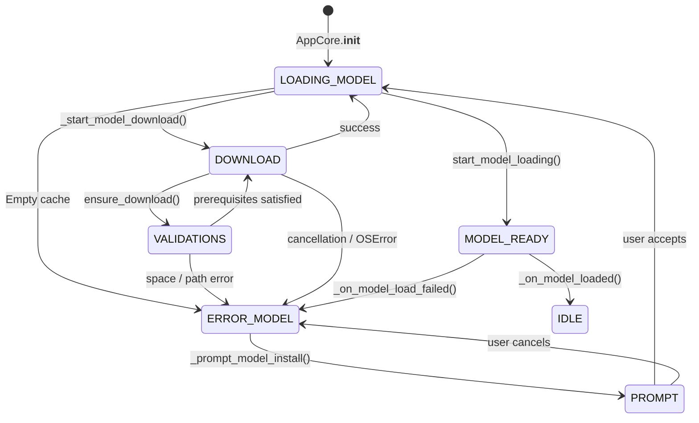

# Model download and loading flow

This document tracks the control flow that starts in `AppCore.__init__` and covers `_prompt_model_install()`, `_start_model_download()`, and `TranscriptionHandler.start_model_loading()`. It reflects the CT2-only backend that powers the minimal workflow.

## Scope
The goal is to clarify how `STATE_LOADING_MODEL`, `STATE_ERROR_MODEL`, and `STATE_IDLE` propagate through the application, how metadata about each download attempt is recorded, and how the bootstrap sequence avoids re-downloading models when the cache is healthy.

## State transitions at a glance
1. `AppCore` starts in `STATE_LOADING_MODEL` and checks whether the configured model exists in the cache. If the directory is empty, `_set_state(STATE_ERROR_MODEL)` fires before asking for confirmation. 【F:src/core.py†L106-L140】
2. Each `_set_state()` call updates `current_state` and schedules `state_update_callback` on the Tk main thread. This keeps the tray icon aligned with the backend status. 【F:src/core.py†L532-L545】
3. When the user approves a download, `AppCore.download_model_and_reload()` records `status=in_progress`, spawns a cancellable thread, and calls `ModelManager.ensure_download()`. A `ModelDownloadResult` reports the destination directory and whether a new download occurred. 【F:src/core.py†L334-L408】【F:src/model_manager.py†L981-L1102】
4. `ensure_download()` prepares the target directory, resumes partial transfers when possible, estimates the size via Hugging Face, checks free space with a 10% safety margin (minimum 256 MiB), and aborts early when storage is insufficient. Metadata files (`install.json`) are refreshed even when the cache is already complete. 【F:src/model_manager.py†L1032-L1197】
5. After the download (or when the cache was already valid), `TranscriptionHandler.start_model_loading()` creates `ModelLoadThread`. `_load_model_task()` then calls either `on_model_ready_callback` or `on_model_error_callback`. 【F:src/transcription_handler.py†L440-L535】
6. `_on_model_loaded()` switches the application back to `STATE_IDLE`, registers the hotkeys, and stores `status=success` with the resolved path. `_on_model_load_failed()` keeps `STATE_ERROR_MODEL` and records the failure for inspection. 【F:src/core.py†L362-L436】

## Mermaid overview

## Scenarios
### Happy path
1. The model is cached or the user approves the download. `_set_state(STATE_LOADING_MODEL)` runs before `ensure_download()` to keep the UI busy and to persist `status=in_progress`. 【F:src/core.py†L334-L408】
2. If `ensure_download()` finds a complete installation, it refreshes `install.json`, returns `downloaded=False`, and the backend simply reloads. Otherwise, the download proceeds with a cancellable progress bar, disk validation, and cleanup of partial directories before reporting success. 【F:src/model_manager.py†L1032-L1197】
3. `TranscriptionHandler.start_model_loading()` spins `ModelLoadThread`, which ends in `on_model_ready_callback`. The callback calls `_on_model_loaded()`, sets `STATE_IDLE`, registers hotkeys, and updates the status to `success`. 【F:src/transcription_handler.py†L440-L535】【F:src/core.py†L362-L408】

### Network errors or failed downloads
Any exception raised by `ensure_download()` (`HTTPError`, `RuntimeError`, etc.) logs `status=error`, shows a notification, and leaves the application in `STATE_ERROR_MODEL`. The UI keeps reporting the error until the operator retries. 【F:src/core.py†L424-L433】【F:src/model_manager.py†L1181-L1232】

### Missing or invalid cache
If the configured directory is empty, the core forces `STATE_ERROR_MODEL` before prompting. Should `TranscriptionHandler._load_model_task()` run with a missing cache, a `FileNotFoundError` triggers `on_model_error_callback` and the state stays in error. Invalid directories (`OSError`) follow the same path. 【F:src/core.py†L106-L140】【F:src/transcription_handler.py†L537-L675】

### Cancelled download
When the user cancels the progress dialog (`DownloadCancelledError`), `_start_model_download()` restores `STATE_ERROR_MODEL`, records `status=cancelled`, and keeps the application waiting for a new confirmation. 【F:src/core.py†L415-L423】【F:src/model_manager.py†L1190-L1207】

### Insufficient disk space
If the estimated size exceeds the free space after applying the safety margin, `ensure_download()` raises `InsufficientSpaceError`. The state stays in error until space is freed or the directories in `advanced.storage.*` are updated. 【F:src/model_manager.py†L1065-L1102】

### Incomplete installation
If Hugging Face finishes downloading but `_is_installation_complete()` spots missing files, the partial directory is cleaned up, `status=error` is persisted, and the state returns to `STATE_ERROR_MODEL`. 【F:src/model_manager.py†L1227-L1254】

## Additional notes
- All state transitions rely on `state_lock` to stay thread-safe before the Tk callback is scheduled. 【F:src/core.py†L532-L545】
- `_set_state()` never forces `STATE_IDLE` while a download or model load is in progress. Only `_on_model_loaded()` can resolve back to idle. 【F:src/core.py†L362-L408】
- `ModelManager.ensure_download()` invalidates the cached listing after any attempt so the UI reflects the correct availability in the menu. 【F:src/model_manager.py†L1197-L1254】
