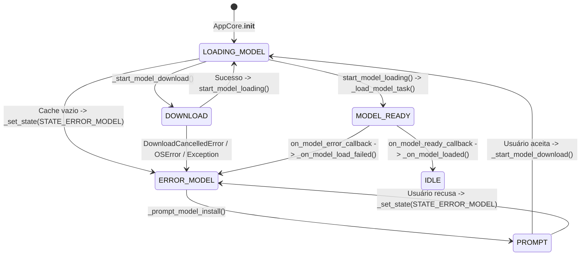

# Ciclo de Download e Carregamento de Modelos

## Escopo
Este documento descreve o encadeamento de chamadas iniciado em `AppCore.__init__` que cobre `_prompt_model_install()`, `_start_model_download()` e `TranscriptionHandler.start_model_loading()`. O objetivo é explicitar como os estados `STATE_LOADING_MODEL`, `STATE_ERROR_MODEL` e `STATE_IDLE` são atualizados via `_set_state()` e propagados para a interface pelo `state_update_callback` do `AppCore`.

## Visão geral das transições de estado
1. O `AppCore` inicia em `STATE_LOADING_MODEL` e imediatamente verifica se o modelo selecionado existe no cache local. Caso o diretório esteja vazio, `_set_state(STATE_ERROR_MODEL)` é chamado antes de solicitar confirmação do usuário para baixar o modelo (`_prompt_model_install()`). 【F:src/core.py†L106-L136】【F:src/core.py†L532-L545】
2. Sempre que `_set_state()` altera `current_state`, a função agenda a execução de `state_update_callback` na *main thread* do Tkinter (`main_tk_root.after`). Com isso, a UI recebe notificações assíncronas sobre `STATE_LOADING_MODEL`, `STATE_ERROR_MODEL` ou `STATE_IDLE`. 【F:src/core.py†L532-L545】
3. Após o download ou quando o cache já contém os arquivos, `start_model_loading()` cria `ModelLoadThread`, cujo trabalho é executar `_load_model_task()`. Esse método chama `on_model_ready_callback` ou `on_model_error_callback`, amarrando a finalização do fluxo a `_on_model_loaded()` ou `_on_model_load_failed()` no `AppCore`. 【F:src/core.py†L137-L140】【F:src/transcription_handler.py†L440-L535】【F:src/transcription_handler.py†L658-L675】
4. `_on_model_loaded()` finaliza o caminho feliz sinalizando `STATE_IDLE` e habilitando os hotkeys. Quando ocorre qualquer falha (problemas de rede, diretório inválido ou ausência de cache), `_on_model_load_failed()` mantém `STATE_ERROR_MODEL` até que a condição seja resolvida. 【F:src/core.py†L362-L407】

## Fluxograma Mermaid

## Cenários detalhados
### Caminho feliz
1. O modelo já está no cache ou o usuário confirma o download. `AppCore._set_state(STATE_LOADING_MODEL)` é chamado antes da execução de `ensure_download()` para manter a UI bloqueada enquanto o arquivo é transferido. 【F:src/core.py†L174-L194】
2. Após o download, `TranscriptionHandler.start_model_loading()` inicia `ModelLoadThread`, que termina em `on_model_ready_callback`. Este callback executa `_on_model_loaded()`, define `STATE_IDLE` e registra os hotkeys. 【F:src/transcription_handler.py†L440-L535】【F:src/core.py†L362-L388】

### Erro de rede ou falha durante o download
* Qualquer exceção disparada por `ensure_download()` (como perda de conexão ou HTTP 403) cai no bloco `except Exception`, registrando o erro, exibindo mensagem e retornando `STATE_ERROR_MODEL`. O callback de UI continua recebendo `STATE_ERROR_MODEL` até que uma nova tentativa seja feita. 【F:src/core.py†L174-L194】

### Cache ausente ou inválido
* Se o diretório configurado estiver vazio, o núcleo já força `STATE_ERROR_MODEL` antes de perguntar ao usuário. Se `TranscriptionHandler._load_model_task()` for acionado com um cache realmente ausente, um `FileNotFoundError` gera `STATE_ERROR_MODEL` via `on_model_error_callback`. Diretórios inválidos (`OSError`) seguem o mesmo caminho. 【F:src/core.py†L125-L141】【F:src/transcription_handler.py†L537-L675】

### Cancelamento do download
* Quando o usuário cancela a operação (via `DownloadCancelledError`), `_start_model_download()` restaura `STATE_ERROR_MODEL` e informa que o download foi abortado. O fluxo permanece nesse estado até que o usuário reabra o prompt e confirme novamente. 【F:src/core.py†L174-L194】

## Observações adicionais
* Todas as transições de estado são encadeadas pela `state_lock`, garantindo consistência entre threads antes do disparo do `state_update_callback` agendado no Tkinter. 【F:src/core.py†L532-L545】
* `_set_state()` nunca força `STATE_IDLE` durante `STATE_LOADING_MODEL`, evitando que a UI volte ao estado ocioso enquanto o modelo é baixado ou inicializado em `ModelLoadThread`. Qualquer retorno a `STATE_IDLE` depende explicitamente de `_on_model_loaded()`. 【F:src/core.py†L362-L388】
